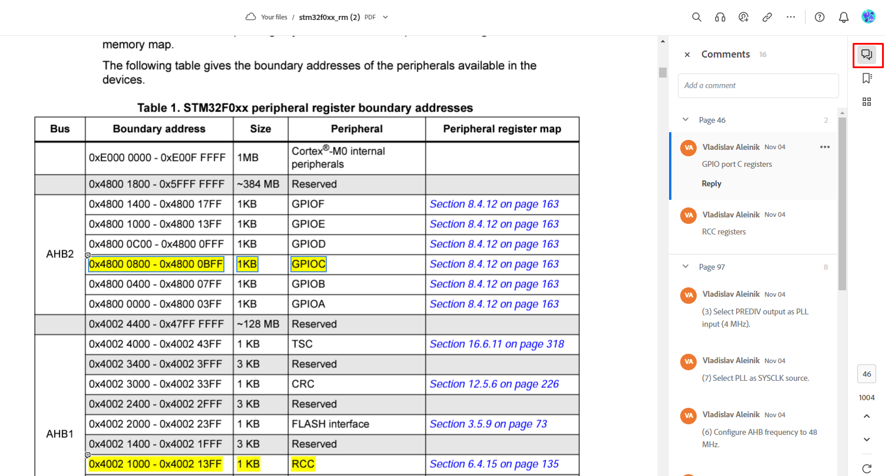

## Описание лабораторной работы
В этой работе вы познакомитесь с принципами работы микроконотроллера STM32. Научитесь его программировать, познакомитесь с документацией. В работе вы исследуете простейший пример программы и просимулируете ее работу в среде моделирования QEMU.

В работе мы будем очень часто ссылать на документацию(даташит) STM32, делаем мы это намеренно. Дело в том, что именно документация, а не туториалы в интернете дает полное представление о микроконтроллере. В профессиональной работе вы обязательно встретитесь с проблемами, которые не получится решить без внимательного прочтения даташита. Полезно уже в самом начале приучать себя к чтению документации на английском языке.

Также в этой работе есть ссылки на документы и видео. **Обязательно просматривайте документы и видео!** Невозможно описать все аспекты STM32 в методичке к лабораторной работе, так что мы предполагаем, что вы будете все смотреть и читать.

## Подготовка
Для программирования микроконтроллера необходимо установить минимальный набор программ - toolchain. Инструкция для установки toolchain под Linux находится [здесь](../../Toolchain-installation.md).

Перед началом работы с микроконтроллером необходимо просмотреть документацию по нему. В этой лабораторной работе мы будем работать только с двумя документами:
- [stm32f0discovery](docs/stm32f0discovery.pdf) - описание отладочной платы.
- [stm32f0xx_rm](docs/stm32f0xx_rm.pdf) - полное описание памяти и периферии микроконтроллера STM32.

Документы снабжены комментариями, чтобы вам удобнее было ориентироваться по ним. Список всех комментарии можно посмотреть, например, в программе Adobe Acrobat Reader. Подойдет бесплатная десктопная версия или онлайн-версия. В онлайн-версии список всех комментариев выглядит вот так:



### Запуск кода на QEMU
В данном репозитории находится код, который мигает светодиодом. Перед тем погружением в файлы репозиторий и их изучения, убедимся в том, что код работает. Для этого запустим его в среде моделирования QEMU.

TODO Напишите туториал по запуске кода в QEMU. Я не могу, так как у меня винда

## Описание файлов в репозитории
Для понимания процесса сборки файлов настоятельно рекомендуем посмотреть [данное видео](https://youtu.be/qWqlkCLmZoE?t=678). После просмотра вы поймете зачем нужный .c, .s, .o, .lds  файлы и как из кода Си получается исполняемый файл для микроконтроллера.

Теперь приступим к описанию файлов в репозитории:
- [Makefile](Makefile) - файл для сборки проекта;
- [blinkled.c](blinkled.c) - тот самый код на Си, который управляет светодиодами;
- [entry.S](entry.S) - код на языке ассемблер, который выполняется до функции main, мы рассмотрим его подробно в следующих лабораторных;
- [entry.lds](entry.lds) - линкер-скрипт - определяет как в конечной программе должны располагаться секции, мы рассмотрим его подробно в следующих лабораторных.

## Описание процесса сборки
Описание синтаксиса Makefile выходит за рамки данного курса. Если вы не знакомы с синтаксисом Makefile, то рекомендуем [данное видео](https://youtu.be/Bsq6P1B8JqI).

Давайте соберем наш проект и создадим исполняемый файл. Для начала создадим папку build:
```
mkdir build
```
Теперь сгенерируем объектный файл из ассемблерного [entry.S](entry.S):
```
arm-none-eabi-gcc -march=armv6-m -mcpu=cortex-m0 -o build/entry.o -c entry.S
```
`arm-none-eabi-gcc` - компилятор, а `-march=armv6-m -mcpu=cortex-m0` - флаги, которые указывают на то, что мы собираем код для ARM процессора с ядром cortex-m0. 
Теперь создадим объектный файл из [blinkled.c](blinkled.c):
```
arm-none-eabi-gcc -march=armv6-m -mcpu=cortex-m0 -o build/blinkled.o -c blinkled.c
```
И осталось создать исполняемый .elf файл:
```
arm-none-eabi-gcc -nostdlib -march=armv6-m -mcpu=cortex-m0 -Wl,-T,entry.lds build/entry.o build/blinkled.o -o build/blinkled.elf
```
Смысл флага `-nostdlib` можно посмотреть [в документации gnu](https://gcc.gnu.org/onlinedocs/gcc-4.4.7/gcc/Link-Options.html#:~:text=option%20is%20specified.-,%2Dnostdlib,used%20to%20ensure%20C%2B%2B%20constructors%20will%20be%20called%3B%20see%20collect2.). Флаг `-Wl,-T,entry.lds` передает линкеру скрипт, согласно которому линкер должен будет разместить секции.

Последний шаг. Создадим файл, который можно будет загрузить в микроконтроллер:
```
arm-none-eabi-objcopy -O binary build/blinkled.elf build/blinkled.bin
```
Готово! Чтобы не писать всё это при каждом изменении проекты как раз и нужен Makefile. Вместо всех этих строчек можно написать `make`. Чтобы удалить все исполняемые файлы, достаточно исполнить `make clean`.

## Описание blinkled.c
Теперь мы можем приступить непосредственно к прогрммированию микроконтроллера. **Самая главная концепция программирования STM32**, которую нужно держать в голове - это то, что управление переферией контроллера происходит двумя способами:
- Специальный ассемблерные инструкции. В данной лабораторной работе мы не будем их касаться;
- Запись информации в специальные участки памяти, которые называются регистрами.

Именно изменяя информацию в регистрах можно управлять микроконтроллером. Рассмотрим для примера следующую команду, которая находится внизу файла [blinked.c](blinked.c):
```C
*(volatile uint32_t*)(uintptr_t)0x48000814U |=  0x100U;
```
Данная команда записывает единицу в восьмой бит по адресу 0x48000814. Выставление единицы по этому адресу включает синий светодиод на отладочной плате! 

А вот следующая команда выставляет в этом же бите 0 и выключает синий светодиод.
```C
*(volatile uint32_t*)(uintptr_t)0x48000814U &= ~0x100U;
```
Любой, владеющий булевой логикой и синтаксисом языка Си может убедиться сам, что данные команды действительно выставляют единицу и ноль в восьмом бите по адресу 0x48000814 и, что важно, не изменяют значение других битов.

Каким же образом мы определили, что восьмой бит по адресу 0x48000814 управляет состоянием синего светодиода на отладочной плате? Давайте заглянем в документацию!

Во-первых, скачайте Adobe Acrobat Reader, если вы этого еще не сделали или зарегистрируйтесь в онлайн версии. Далее, откройте документы из папки [docs](docs/) в Adobe Acrobat. Теперь заглянем в [stm32f0discovery](docs/stm32f0discovery.pdf). Мы выделили те строчки документации, которые понадобятся нам в этой лабораторной работе. Итак, в документации на плату написано:

> User LD4: Blue user LED connected to the I/O PC8 of the STM32F051R8T6. 

Значит, синий светодиод подключен к ножке микроконтроллера под названием PC8. В микроконтроллере много выходных ножек, для удобства их группируют. PC8 означает, что выходная ножка принадлежит к группе ножек С, а её номер равен 8. Группу ножек С будем обозначать GPIOC (General Purpose Input Output C).
Теперь заглянем в [stm32f0xx_rm](docs/stm32f0xx_rm.pdf). 

В списке всех комментариев вы можете увидеть вот такую табличку:


Значит, регистры, управляющие GPIOC находятся по адресу 0x48000800-0x48000BFF. 

Правее ссылка на описание всех управляющих регистров. Если перейти по ней, то можно увидеть огромную таблицу, в которой перечислены все биты, контролируюшие GPIOC. Нас интересуют биты, которые выставляют 0 или 1 на выходе ножки, они находятся в регистре GPIOx_ODR, где x - группа. Из таблицы мы видим, что offset у этого регистра = 0x14. Под offset подразумевается смещение относительно первого регистра, управляющего данной группой. В нашем случае это 0x48000800. 

Итого, получается 0x48000800 + 0x14 = 0x48000814, а это как раз тот самый регистр, в который мы записываем данные в нашей программе!

Теперь подробнее посмотрим на GPIOx_ODR. Перемотайте чуть выше до описание этого регистра, вы должны видеть это:


Здесь все просто, i-ый бит соответсвует i-ой ножке в группе ножек С. А значит мы должны менять 0x100 бит в 0x48000814, что мы и делаем в коде. Попробуйте самостоятельно изменить код так, чтобы мигал не синий, а зеленый светодиод. 

> Чтобы подробнее познакомиться с GPIO советуем просмотреть главу 8 General-purpose I/Os (GPIO).

Теперь, когда мы посмотрели на примере как происходит управление микроконтроллером, мы можем понять что происходит в [blinked.c](blinked.c). Начнем с первой функцией, которая вызвается в main - функция включения тактирования.

Чтобы понять что происходит дальше нужно обязательно посмотреть видео про [тактирование в STM32](https://www.youtube.com/watch?v=PP94Q0OYLkY&list=PLhtMaaf_npBzsEQ94eGn5RnuE-VdGVObR&index=5).

```C
void board_clocking_init()
{
    // (1) Clock HSE and wait for oscillations to setup.
    *REG_RCC_CR = 0x00010000U;
    while ((*REG_RCC_CR & 0x00020000U) != 0x00020000U);

    // (2) Configure PLL:
    // PREDIV output: HSE/2 = 4 MHz
    *REG_RCC_CFGR2 |= 1U;

    // (3) Select PREDIV output as PLL input (4 MHz):
    *REG_RCC_CFGR |= 0x00010000U;

    // (4) Set PLLMUL to 12:
    // SYSCLK frequency = 48 MHz
    *REG_RCC_CFGR |= (12U-1U) << 18U;

    // (5) Enable PLL:
    *REG_RCC_CR |= 0x01000000U;
    while ((*REG_RCC_CR & 0x02000000U) != 0x02000000U);

    // (6) Configure AHB frequency to 48 MHz:
    *REG_RCC_CFGR |= 0b000U << 4U;

    // (7) Select PLL as SYSCLK source:
    *REG_RCC_CFGR |= 0b10U;
    while ((*REG_RCC_CFGR & 0xCU) != 0x8U);

    // (8) Set APB frequency to 24 MHz
    *REG_RCC_CFGR |= 0b001U << 8U;
}
```
Здесь мы последовательно выставляем биты в нужных регистрах. (i) указывает на комментарий в документе [stm32f0xx_rm](docs/stm32f0xx_rm.pdf). Согласно этому документу и видео выше запускается тактирование на микроконтроллере.

Остановимся на функции board_gpio_init() и внимательно ее рассмотрим.

Чтобы понять что происходит дальше нужно обязательно посмотреть видео про [управление GPIO STM32](https://www.youtube.com/watch?v=ynBOKPnYlyY&list=PLhtMaaf_npBzsEQ94eGn5RnuE-VdGVObR&index=5).


```C
void board_gpio_init()
{
    // (1) Enable GPIOC clocking:
    *REG_RCC_AHBENR |= 0x80000U;

    // (2) Configure PC8 mode:
    *GPIOC_MODER |= 0b01U << (2*8U);

    // (3) Configure PC8 type:
    *GPIOC_TYPER |= 0b0U << 8U;
}
```
Упоминание о REG_RCC_AHBENR в документе находится здесь:


Значит, регистры, которые управляют тактирование GPIOC находятся по адресу 0x40021000 - 0x400213FF. Нас инетересует регистр под названием RCC_AHBENR, рассмотрим его:


Из документации понятно, что бит IOPCEN отвечает за включение тактирования на шине GPIOC. В Регистре RCC_AHBENR он находится на 19 позицией, 2^19 = 0x80000.

Рассмотрим GPIOC_MODER. На самом деле он равен уже знакомому нам регистру 0x48000800. Это связано с тем, что offset у этого регистра равен 0.


Для того, чтобы управлять светодиодом мы должны правильно выставить режим работы ножки, к которой подключен светодиод. Делается это выставление 01 по адресу MODER8[1:0], MODERi отвечает за i-ый пин. Именно это и делает вторая команда функции board_gpio_init().

Итак, осталась последния команда. Самостоятельно найдите определение GPIOC_TYPER в даташите и определите что делает последняя команда. Будьте внимательны, GPIOC_TYPER - это просто define адреса регистра в файле blinked.c, в даташите регистр по этому адресу называется иначе. 

## Задачи к лабораторной №0
- Запустить код в эмуляторе
- Разобраться в коде, вам в любой момент времени должно быть понятно, в какой бит какого регистра осуществляется запись.
- В реальных проектах никогда не обращаются к памяти напрямую, как мы это делали здесь: `*(volatile uint32_t*)(uintptr_t)0x48000814U |= 0x100U;` Потому что это небезопасно, несложно сделать ошибку при написании 0x48000814 и невозможно держать в голове таблицу всех регистров микроконтроллера, для этих целей пишутся define для всех адресов. В blinked.c уже определены define для некоторых адресов. Ваша задача состоит в том, чтобы определить define для всех адресов файла. И название define должно совпадать с названием регистра в даташите! 
- Напишите макросы для работы с регистрами и битами

```C
#define SET_BIT(REG, BIT)     // выставление бита BIT в регистре REG в 1
#define CLEAR_BIT(REG, BIT)   // выставление бита BIT в регистре REG в 0
#define READ_BIT(REG, BIT)    // возвращает бит BIT регистра REG
#define CLEAR_REG(REG)        // выставление регистра REG в 0
#define WRITE_REG(REG, VAL)   // выставление регистра REG в VAL
#define READ_REG(REG)         // возвращает регистр REG

// Все выставленные биты CLEARMASK будут обнулены в регистре REG
// Все выставленные биты SETMASK будут выставлены в 1 в регистре REG
#define MODIFY_REG(REG, CLEARMASK, SETMASK) 

```
- Измените программу так, чтобы плата попеременно моргала синим и зелёным диодами.
- [ ] Отправить сигнал SOS азбукой морзе с диода. **Зачем?**
- [ ] Со **звездой**: **Написать на ARM ассемблере timing-perfect delay. Доказать, что он точный, ссылаясь на документацию.** (*на железе*) - может дать эту задачу позже? И так много инфы
