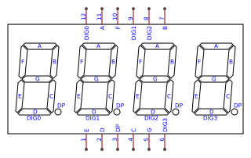
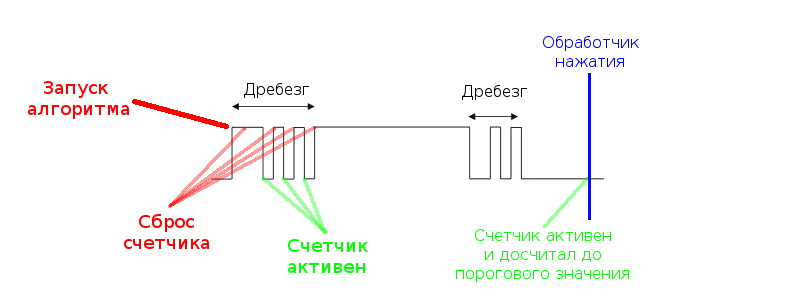
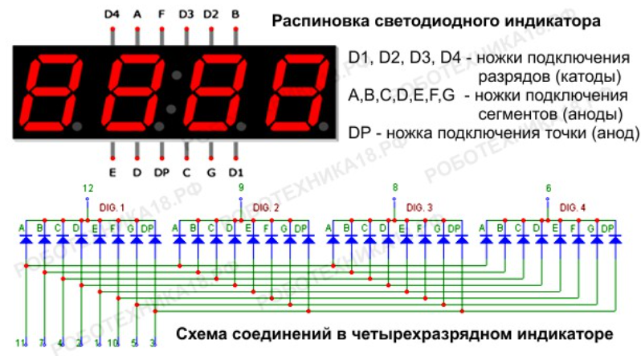

# Лабораторная работа №02: Работа с GPIO

## Описание лабораторной работы

В этой работе вы поближе познакомитесь с модулем GPIO:
- Подключение кнопки и работа с ней;
- Подключение семисегментного индикатора и работа с ним.

Предполагается, что вы ознакомились с первой лабораторной работой и умеете искать в документации нужную информацию.

## Подключение компонентов

В данной лабораторной работе вы будете работать на макетной плате. Вам понадобится кнопка и 4-канальный семисегментный индикатор.

Подключите семисегментный индикатор таким образом, чтобы номер пина семисегментника на картинке совпадал с номером пина порта A:



Подключать кнопку не потребуется, так как она уже распаяна на макетной плате и подведена к PA0 с одной стороны и к питанию с другой. При нажатии на кнопку на пине PA0 должна быть логическая единица.

Соберите код с помощью `make` и загрузите код в микроконтроллер с помощью `make flash`. Понимажимайте на кнопку, убедитесь, что отсчет на индикаторе останавливается во время нажатия.

## Работа с кнопкой

В прошлой лабораторной работе мы научились управлять выходными пинами микроконтроллера. Но чтобы взаимодействовать с внешним миром, мы должны научиться считывать значение с пина.

> Чтобы понять что происходит дальше рекомендуется посмотреть видео про [управление GPIO на STM32](https://www.youtube.com/watch?v=ynBOKPnYlyY&list=PLhtMaaf_npBzsEQ94eGn5RnuE-VdGVObR&index=5).

На самом деле, считывать значение с ножки просто:
1. Настроим режим пина на вход;
2. Включим подтягивающий на землю резистор;
3. Прочитаем бит регистра, который хранит в себе значение на пине.

Именно это и происходит в функции `board_gpio_init()`. В функции мы конфигурируем пин PA0 в режим входа с подтягивающим к земле резистором, а PA1-PA12 конфигурируем в режим выхода. Самостоятельно сверьте регистры с описаниями в даташите и замените все константы в коде на define-ы.

Чтобы считать значение на входе PA0, нужно обратиться к даташиту:


Значит, нужно прочитать нулевой бит регистра GPIOA_IDR, это и происходит в строчке функции main:
```C
bool active = *GPIOA_IDR & (1U << 0U);
```

Далее идет неочевидный на первый взгляд код:
```C
if (active)
{
    if (saturation < 5U)
    {
        saturation += 1U;
    }
    else
    {
        button_was_pressed = 1U;
    }
}
else
{
    saturation = 0U;
}
```
Данный код позволяет избавиться от явления **дребезга контактов**. Давайте взглянем на осциллограмму пина, к которому подключена ножка:



При нажатии на кнопку пин не сразу переходит в постоянное высокое состояние, а испытывает скачки. Из-за этого мы не можем быть уверены, что при переходе с 0 на 1 кнопка была нажата, мы должны детектировать высокое состояние хотя бы в течение нескольких тактов, чтобы явление дребезга прошло. Когда дребезг прошел, мы выставляем переменную `button_was_pressed` в единицу.

## Работа с семисегментным индикатором

Выглядит он следующим образом:


Чтобы понять, как это работает, взглянем на внутреннее устройство индикатора:



Вы можете заметить, что индикатор имеет 28 светодиодных палочек и 4 светодиодных точек, но выходов у индикатора только 12. Каким образом 12 выходов управляют 32 светодиодами?

Ответ заключается в механизме динамической индикации и использовании свойства инерционности глаза.

Подробное описание принципа динамической индикации можно почитать [тут](https://www.radiokot.ru/start/mcu_fpga/avr/15/). Если коротко, восемь входов управляют светодиодными палочками в индикаторе, и 4 входа отвечают за номер цифры, которая отображается на индикаторе. Если подтянуть к земле все 4 катода, то все цифры покажут одно и то же значение. Чтобы цифры показывали разные значения нужно подтягивать катоды к земле по очереди и выставлять нужные значения на анодах. Таким образом цифры будут появляться по очереди. Если переключения достаточно быстрые, то можно получить "статическую" картину, при этом в конкретный момент времени будет гореть только один индикатор, а не все.

Это и происходит в цикле функции main:
```C
SEG7_push_display_state_to_mc(&seg7);
```
Данная функция просто записывает значение переменной `seg7->display` в GPIOA_ODR. `seg7->display` имеет тип `uint32_t`, а регистр GPIOA_ODR как раз размером в 32 бита.

Интересно то, каким образом формируется `seg7->display`. А происходит это в:

```C
void SEG7_set_number_quarter(struct Seg7Display* seg7, unsigned tick)
{
    uint32_t divisors[4] = {1, 10, 100, 1000};

    unsigned quarter = tick % 4;
    unsigned divisor = divisors[quarter];

    seg7->display = DIGITS[(seg7->number / divisor) % 10] | POSITIONS[quarter];
}
```

В зависимости от остатка деление текущего тика на 4 мы выбираем катод, а саму цифру мы берём из переменной `seg7->number`. С помощью нехитрой конструкции `(seg7->number / divisor) % 10` выбирается нужный десяток, а ` | POSITIONS[quarter]` подтягивает к питанию все катоды, кроме одного. Итого, загорится только одна цифра с нужным значением десятков. Самостоятельно разберитесь в определении констант.

В этой лабораторной мы подрбоно рассмотрим [entry.S](entry.S) и [entry.lds](entry.lds).

## Описание entry.S

[entry.S](entry.S) определяет код, который будет исполняться до функции main. В этой лабораторной работе он довольно простой, но дальше он будет усложняться. Давайте разберём его step-by-step.

```assembly
.syntax unified

.section .text

.thumb_func
.global __reset_handler
__reset_handler:
    blx main
__halt:
	b __halt

.section .vector_table
.word __stack_start
.word __reset_handler
```

- `.syntax unified` - директива, которая определяет [тип синтаксиса файла](https://sourceware.org/binutils/docs/as/ARM_002dInstruction_002dSet.html).
- `.section .text` - директива, которая определяет, что код ниже должен находиться в секции `.text`. Как правило, в данной секции находится код программы.
- `.thumb_func` - директива, означает, что функция ниже написана в наборе инструкций типа Thumb. Для продвинутых, описание набора инструкций типа Thumb и ARM можно посмотреть [здесь](http://twins.ee.nctu.edu.tw/courses/ip_core_01/lab_hw_pdf/lab_1.pdf).
- `.global __reset_handler` - директива, означает, что символ (функция) `__reset_handler` должен быть виден из любой секции программы.
- `__reset_handler:` - определение символа `__reset_handler`.
- `blx main` - инструкция, которая перемещает текущее положение PC (Program Counter - адрес выполняемой команды) на символ `main`. Здесь и происходит вызов функции main.
- `b __halt` - инструкция, которая также перемещает текущее положение PC (Program Counter - адрес выполняемой команды) на символ `__halt`. Различие `B` и `BLX` можно посмотреть в [документации ARM](https://developer.arm.com/documentation/dui0489/h/arm-and-thumb-instructions/b--bl--bx--blx--and-bxj).
- `.section .vector_table` - определение секции vector_table. Данная секция содержит адрес начала стека `.word __stack_start`, адрес начального положения PC `.word __reset_handler` и адреса функций, который должны обрабатывать прерывания. Так как в нашей лабораторной нет прерываний, мы опустим их объявление. Символ `__reset_handler` определен выше, а символ `__stack_start` определен в линкер-скрипте.

## Описание линкер-скрипта
Как вы знаете, линкер объединяет входные файлы в один выходной файл. Выходной файл и каждый входной файл находятся в специальном формате данных, известном как ***формат объектного файла (.o)***. Каждый объектный файл имеет список секций (sections). Каждая секция в объектном файле имеет имя и размер. Некоторые секции имеют содержимое, например, секция `.text` хранит в себе код программы, секция `.data` хранит в себе данные программы.

Каждая секция вывода имеет два адреса: VMA (Virtual Memory Adress) и LMA (Load Memory Adress). VMA - адрес, который секция будет иметь, во время исполнения выходного файла. LMA - адрес, по которому секция будет загружена. В большинстве случаев два адреса будут одинаковыми. Пример когда они могут отличаться, это когда раздел данных загружается во Flash-память, а затем копируется в SRAM-память при запуске программы. В этом случае адрес во Flash будет LMA, а адрес в SRAM будет VMA. Копирование нужно, чтобы сохранить данные при выключении микроконтроллера. Когда микроконтроллер отключается от питания, все данные в SRAM стираются, а во Flash сохраняются.

Каждый объектный файл также имеет список символов, известный как таблица символов. Символы бывают определенными или неопределенными. У каждого символа есть имя, а у каждого определенного символа есть адрес. Если вы скомпилируете программу на C или C++ в объектный файл, то каждая функция, глобальная или статическая переменная получит определенный символ. А каждая неопределенная функция или глобальная переменная, на которые есть ссылка во входном файле, получат неопределенный символ. Задача линкера - собрать все символы со всех объектных файлов и определить все неопределенные символы.

Давайте посмотрим на сгенерированные объектные файлы. Для этого выполните данные команды:
```
cd build
arm-none-eabi-objdump -t entry.o
```

Вы должны увидеть это:
```
SYMBOL TABLE:
00000000 l    d  .text  00000000 .text
00000000 l    d  .data  00000000 .data
00000000 l    d  .bss   00000000 .bss
00000004 l       .text  00000000 __halt
00000000 l    d  .vector_table  00000000 .vector_table
00000000 l    d  .ARM.attributes        00000000 .ARM.attributes
00000000 g     F .text  00000000 __reset_handler
00000000         *UND*  00000000 main
00000000         *UND*  00000000 __stack_start
```
Первый столбец - это значение символа. Оно у всех ноль, кроме символа `__halt`, потому что он расположен сразу после символа `__reset_handler:`, который из-за команды `blx main` имеет размер 4 байта.

Второй столбец - флаги символов. Флаг `l` означает, что символ локальный и виден только из данного файла, `g` означает, что символ глобальный. Глобальным является только символ `__reset_handler`, потому что перед ним явно написана директива `.global` в файле [entry.S](entry.S). Далее, `F` означает, что символ является именем функции, d означает, что символ создан для отладки программы (debug).

Третий столбец определяет секцию, в которой находится символ. `*UND*` означает, что секция не определена.

Пятый столбец - это имя символа.

Линкер-скрипт управляет работой линкера. [entry.lds](entry.lds) - определяет как в конечной программе должны располагаться секции и определяет каким образом должна быть разделена память. Давайте рассмотрим этот скрипт step-by-step.

```assembly
ENTRY(__reset_handler);

FLASH_VADDR = 0x08000000;
FLASH_SIZE  = 0x00010000;
SRAM_VADDR  = 0x20000000;
SRAM_SIZE   = 0x00002000;

SECTIONS
{
    . = 0x00000000;

    .text : AT(ADDR(.text) + FLASH_VADDR)
    {
        KEEP(*(.vector_table));
        *(.text)
        *(.rodata)
    }

    __stack_start = SRAM_VADDR + SRAM_SIZE;
}
```

- `ENTRY(__reset_handler);` - определяет символ, с которого мы должны начать выполнение программы.
- `FLASH_VADDR = 0x08000000;` - константа. Адрес начала Flash-памяти. Значение этой константы должно совпадать с разделением памяти в STM32F051, которое можно посмотреть в [stm32f0xx_rm](docs/stm32f0xx_rm.pdf) на странице 45.
- `FLASH_SIZE  = 0x00010000;` - константа. Размер Flash-памяти. Для каждой программы размер Flash-памяти должен определяться отдельно.
- `SRAM_VADDR  = 0x20000000;` - константа. Адрес начала SRAM-памяти. Значение этой константы должно совпадать с разделением памяти в STM32F051.
- `SRAM_SIZE   = 0x00002000;` - константа. Размер SRAM-памяти. Для каждой программы размер SRAM-памяти должен определяться отдельно.
- `SECTIONS` - означает, что ниже будут описаны секции, которые должны быть в конечной программе.
- `. = 0x00000000;` - определение счетчик местоположения (location counte). Определяет на каком адресе мы сейчас находимся. Относительно него будут далее определяться адреса секций.
- `.text : AT(ADDR(.text) + FLASH_VADDR)` - означает, что мы определяем секцию .text. У данной секции LMA = `ADDR(.text) + FLASH_PADDR`. Где `ADDR(.text)` - это VMA адрес секции .text. VMA адрес секции .text будет равен 0x00000000, что соответствует значению счетчика, определенного выше.
- `KEEP(*(.vector_table));` - далее в фигурных скобках перечисляется всё, что должно входить в секцию .text. `*(.vector_table)` означает, что в секцию .text должны входить все секции .vector_table входных файлов. KEEP() нужен для того, чтобы линкер-скрипт не оптимизировал эти секции и не удалил их.
- `*(.text)` - означает, что в секцию .text выходного файлы должны входить все секции .text входных файлов.
- `*(.rodata)` - аналогично.
- `__stack_start = SRAM_VADDR + SRAM_SIZE;` - определяет адрес символа адреса начала стека `__stack_start`.

Давайте посмотрим на результат работы линкер-скрипта. Для этого в папке build нужно выполнить следующую команду:
```
arm-none-eabi-objdump -t blinkled.elf
```
В ответе на команду нас не интересуют все строки, рассмотрим только следующие:
```
00000000 l    d  .text  00000000 .text
00000008 g     F .text  00000000 __reset_handler
0000000c l       .text  00000000 __halt
20002000 g       *ABS*  00000000 __stack_start
```
Согласно линкер-скрипту, по адресу `0x00000000` находится секция .text, в начале которой расположен `.vector_table`. А `.vector_table` в свою очередь состоит из `.word __stack_start` и `.word __reset_handler`. Тогда, по адресу `0x00000000` находится начальное положение стека, а по адресу `0x00000004` находится адрес функции `__reset_handler  `, в этом можно убедиться, если выполнть команду:
```
arm-none-eabi-objdump -t blinkled.elf
```
Ответом на команду будет дизассемблированный исполняемый файл:
```
00000000 <__reset_handler-0x8>:
   0:   20002000        .word   0x20002000
   4:   00000009        .word   0x00000009

00000008 <__reset_handler>:
   8:   f000 f88c       bl      124 <main>

0000000c <__halt>:
   c:   e7fe            b.n     c <__halt>
        ...
```
Видно, что значение `__stack_start` равно `0x20002000`, что совпадает с выводом таблицы символов.

У вас может возникнуть вопрос. Мы загружаем секцию `.text` по адресу LMA, а в коде обращаемся к ней по VMA. И VMA не равен LMA! Тогда каким образом микроконтроллер корректно выполняет наш код? Все дело в стартовой конфигурации микроконтроллера ("Boot Configuration",  !(страницы 52-53)[docs/stm32f0xx_rm.pdf]) - благодаря ней Flash-память отображается не только по адресу `0x08000000`, но и по адресу `0x00000000`.

## Задачи к лабораторной №02
- [ ] Отрефакторить код:
  - [ ] В любой момент времени должно быть понятно, в какой бит какого регистра осуществляется запись.
  - [ ] Реализовать дефайны для всех бит регистров (см. документацию на микроконтроллер).
  - [ ] Реализовать макросы для записи значений в регистры.
  - [ ] Исправить ошибки в Pin Mapping-е (см. документацию на 7-сегментный индикатор).
  - [ ] Выделить заголовочные файлы, где это осмысленно.
- [ ] Со звездой: **Измерить свою скорость реакции до рефакторинга и после рефакторинга. Предоставить данные.**
- [ ] Реализовать игру "*пальчики*":
  - [ ] Есть две кнопки. Если кнопка **№i** нажата, то палец игрока **№i** опущен.
  - [ ] Если в какой-то момент палец игрока **№i** опущен и палец игрока **№j** - опускается, то:
    - Игрок **№i** - повержен, *в смятении*.
    - Игрок **№j** - одержал верх, *торжествует*.
  - [ ] Каждому игроку соответсвует диод (синий PC8, зелёный PC9 или внешний):
    - Если игрок *в смятении*, то его диод мигает с низкой частотой.
    - Если игрок *торжествует*, то его диод мигает с высокой частотой.
  - [ ] На семисегментном индикаторе отображаются счета обоих игроков.
- [ ] Реализовать схему обработки дребезга кнопки "с гистерезисом"
