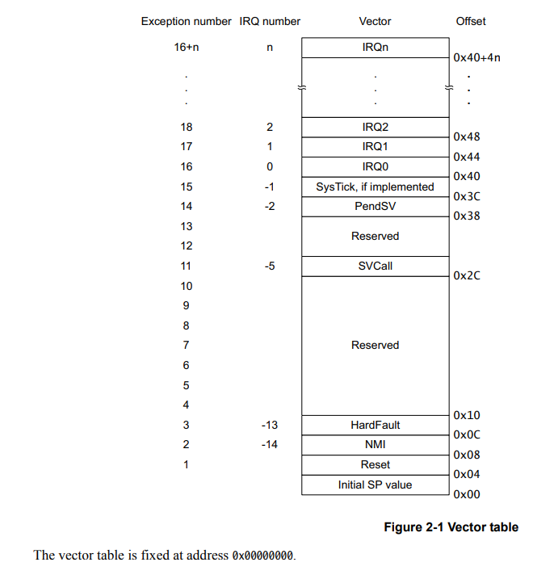

# Лабораторная работа №03: Системный таймер
## Описание лабораторной работы

Это лабораторная работа может показаться сложной, но вы обязательно в ней разберетесь. Вы закрыли матан первого курса(!), а значит и с микроконтроллером справитесь. Но для этого вам нужно понять что происходит в entry.S и entry.lds с прошлой лабораторной работы. **Проделайте все команды**, которые есть в описании к прошлой работе, разберитесь в каждом символе и адресе.

В этой работе у нас будет:
- Работа с прерываниями;
- Работа с таймерами;
- Более глубое погружение в линкер-скрипты и ассемблерные файлы.

Предполагается, что вы умеете искать в документацию нужную информацию.

## Таймеры
Таймер — это просто счетчик, который при достижении заданного значения может вызывать определённые события — прерывания. С помощью таймера можно измерять время, генерировать ШИМ, управлять работой протоколов передачи данных.

Микроконтроллер STM32F051 имеет на борту несколько таймеров:

- One 16-bit 7-channel advanced-control timer for 6 channels PWM output, with deadtime generation and emergency stop;
- One 32-bit and one 16-bit timer, with up to 4 IC/OC, usable for IR control decoding;
- One 16-bit timer, with 2 IC/OC, 1 OCN, deadtime generation and emergency stop
- Two 16-bit timers, each with IC/OC and OCN, deadtime generation, emergency stop and modulator gate for IR control
- One 16-bit timer with 1 IC/OC
- Independent and system watchdog timers
- SysTick timer: 24-bit downcounter
- One 16-bit basic timer to drive the DAC

В работе нас будет интересовать системный таймер (SysTick). Инициализация таймера происходит в файле [systick.c](systick.c) в функции systick_init, а обработчик прерываний в функции systick_handler. Самостоятельно с помощью даташита разберитесь в том, какие регистры записываются в systick_init и к каким последствияем это приводит.

## Прерывания
Для того, чтобы понять что такое прерывания и зачем они нужны, просмотрите [видео по этой теме](https://youtu.be/UZAuIxD40aA).

В нашей работе SysTick генерирует прерывания и вызывает функцию systick_handler. С какой частотой генерируются прерывания? В обработчике прерывания мы просто увеличиваем статическую переменную handler_ticks. По достижению ею 10000 светодиод на плате меняет свое состояние.

Теперь осталось понять каким образом микроконтроллер определяет адрес фукнции обработчика прерываний. Для этого рассмотрим [entry.S](entry.S).

## Описание entry.S
Вы уже знаете, что [entry.S](entry.S) определяет код, который будет исполняться до функции main. Рассмотрим его c конца.

В конце файла определен знакомый вам `.section .vector_table`. Как и в прошлой лабораторной работе, в нем определены начальное значание стека и символ \__reset_handler, но теперь в этой секции определены адреса функций обработчиков прерываний. Вот они:
```assembly
.word __exc_handler         // NMI Handler
.word __exc_handler         // Hard Fault Handler
.fill 7, 4, 0x00            // Reserved
.word __exc_handler         // SVCall
.fill 2, 4, 0x00            // Reserved
.word __exc_handler         // PendSV
.word systick_handler       // SysTick
```

Их порядок не случаен, он описан в [Cortex-M0 Generic User Guide](docs/cortex_m0_gug.pdf):


Итак, порядок обработки прерываний следующий:
1. Процессор принимает прерывание и определяет его номер;
2. Берет адрес функции из вектора прерываний;
3. В это же время происходит сохранение регистров процессора на стек;
4. Переходит по адресу из вектора прерываний. В нашем случае при возникновении прерывания SysTick процессор вызовет функцию, адрес которой лежит по адресу `0x3C`, то есть systick_handler.

Продолжим изучение [entry.S](entry.S). Как вы могли заметить, в [entry.S](entry.S) и [entry.lds](entry.lds) по сравнению с прошлой работой добавилось много кода. Связано это с тем фактом, что в нашей программе мы используем статическую переменную handler_ticks!

Статическая переменная не может храниться в стеке, так как её значение сохраняется при выходе из стека. Следовательно, её значение должно храниться в памяти. Статическая переменная не может находиться во Flash-памяти, потому что эта память является неизменяемой, а в программе мы меняем handler_ticks. Значит, её нужно хранить в SRAM-памяти. Но SRAM-память очищается при выключении питания, остается только Flash-память...

Получился замнкутый круг. С одной стороны, мы хотим, чтобы программа работала при перезагрузке питания, для этого мы должны хранить всё во Flash-памяти. С другой стороны, мы хотим изменять статическую переменную, для этого её нужно хранить в SRAM-памяти. Решение такое:

Давайте будем хранить весь код и все данные во Flash-памяти, а в \__reset_handler будем копировать данные из Flash-памяти в SRAM-память. Это и происходит в \__reset_handler:

```assembly
__reset_handler:
	// Copy .data section to SRAM:
	ldr r0, __data_start_lma_val
	ldr r1, __data_start_vma_val
	ldr r2, __data_end_vma_val

__loop_copy_data_section:
	cmp r1, r2
	beq __loop_copy_data_section_end

	ldr r4, [r0, #0]
	str r4, [r1, #0]

	adds r0, r0, #4
	adds r1, r1, #4
	b __loop_copy_data_section
__loop_copy_data_section_end:

	// Execute actual software:
    blx main
```
По сути, это memncpy(\__data_start_lma_val, \__data_start_vma_val, \__data_end_vma_val - \__data_start_vma_val). Ниже в файле определены сами символы:
```assembly
__data_start_lma_val:
.word __data_start_lma
__data_start_vma_val:
.word __data_start_vma
__data_end_vma_val:
.word __data_end_vma
```
Они заполняются в линкер-скрипте.

## Описание линкер-скрипта
В начале файла определяется стартовая точка программы - \__reset_handler, определяются константы, которые мы будем использовать ниже и размечается память микроконтроллера.
```
ENTRY(__reset_handler);

FLASH_VADDR = 0x00000000;
FLASH_PADDR = 0x08000000;
FLASH_SIZE  = 0x00010000;
SRAM_VADDR  = 0x20000000;
SRAM_PADDR  = 0x20000000;
SRAM_SIZE   = 0x00002000;

MEMORY
{
    FLASH  (rx)  : ORIGIN = FLASH_VADDR, LENGTH = FLASH_SIZE
    SRAM   (rwx) : ORIGIN =  SRAM_VADDR, LENGTH =  SRAM_SIZE
}
```

Ниже идут описания секций. Секция .text остаётся такой же, как и в прошлой работе, за исключением изменения синтаксиса. Теперь мы указываем LMA этой секции с помощью более простой конструкции: `> FLASH`. Переменная FLASH определена в разметке памяти. Ниже определена новая для нас секция .data:
```
.data :
{
    . = ALIGN(4);
    __data_start_vma = .;

    *(.data)

    . = ALIGN(4);
    __data_end_vma = .;
} >SRAM AT >FLASH
```
- `>SRAM AT >FLASH` означает, что LMA = FLASH, а VMA = SRAM.
- `. = ALIGN(4);` нужен, чтобы все адреса были кратны 4. Это необходимо, так как при невыровненном доступе процессор генерирует HardFault.
- `*(.data)` означает, что в данное место нужно поместить все секции .data из всех входных файлов.
- `__data_start_vma = .;` и `__data_end_vma = .;` заполняют переменные, которые мы использовали в ассемблерном файле. Переменная \__data_start_vma примет значение адреса начала секций .data входный файлов, а переменная \__data_end_vma примет значение адреса конца секций .data входный файлов.

Аналогично ниже определена секция .bss. В эту секцию компилятор кладёт все инициализируемые нулём глобальные и статические переменные. И наконец, определяется символ \__data_start_lma.


Давайте посмотрим на сгенерированные объектные файлы. Для этого выполните данные команды:
```
make
cd build
arm-none-eabi-objdump -t entry.o
```

Вы должны увидеть это:
```
SYMBOL TABLE:
00000000 l    d  .text  00000000 .text
00000000 l    d  .data  00000000 .data
00000000 l    d  .bss   00000000 .bss
0000001c l       .text  00000000 __data_start_lma_val
00000020 l       .text  00000000 __data_start_vma_val
00000024 l       .text  00000000 __data_end_vma_val
00000006 l       .text  00000000 __loop_copy_data_section
00000014 l       .text  00000000 __loop_copy_data_section_end
00000018 l       .text  00000000 __halt
0000001a l       .text  00000000 __exc_handler
00000000 l    d  .vector_table  00000000 .vector_table
00000000 l    d  .ARM.attributes        00000000 .ARM.attributes
00000000 g     F .text  00000000 __reset_handler
00000000         *UND*  00000000 main
00000000         *UND*  00000000 __data_start_lma
00000000         *UND*  00000000 __data_start_vma
00000000         *UND*  00000000 __data_end_vma
00000000         *UND*  00000000 __stack_start
00000000         *UND*  00000000 systick_handler
```

Внизу находятся символы, которые определены в других файлах проекта. main и systick_handler определены в systick.c, остальные `*UND*` определены в линкер-скрипте. Зато символы функции \__reset_handler определены и имеют конкретные значения:
```
00000006 l       .text  00000000 __loop_copy_data_section
00000014 l       .text  00000000 __loop_copy_data_section_end
```

Посмотрите на таблицу символов файла systick.c и самостоятельно разберитесь в каждом символе. В его значении, во флагах и в адресе.

Теперь посмотрим на результат работы линкер-скрипта. Для этого в папке build нужно выполнить следующую команду:
```
arm-none-eabi-objdump -t systick.elf
```
В ответе на команду нас не интересуют все строки, рассмотрим только следующие:
```
20000000 l    d  .data  00000000 .data
20000000 g       .data  00000000 __data_start_vma
20000004 g       .data  00000000 __data_end_vma
```
Видно, что секция .data находится по адресу `0x20000000`, а её размер равен 4 байтам, потому что размер переменной handler_ticks - 4 байта. Попробуйте изменить тип handler_ticks в файле [systick.c](systick.c) с типа int на double. Какое значение теперь примет \__data_end_vma? Попробуйте при инициализации присвоить handler_ticks значение = 0. Запустите программу. Что произошло?

Наконец, посмотрим на исполняемый файл:
```
arm-none-eabi-objdump -d systick.elf
```
Ответом на команду будет дизассемблированный исполняемый файл, нас интересует только его начало.
```
Disassembly of section .text:

00000000 <__reset_handler-0x40>:
   0:   20002000        andcs   r2, r0, r0
   4:   00000041        andeq   r0, r0, r1, asr #32
   8:   0000005a        andeq   r0, r0, sl, asr r0
   c:   0000005a        andeq   r0, r0, sl, asr r0
        ...
  2c:   0000005a        .word   0x0000005a
        ...
  38:   0000005a        .word   0x0000005a
  3c:   000001e5        .word   0x000001e5
```
Не обращайте внимание на команды справа, это попытка дизассемьлера распознать команды там, где их нет. Видно, что значение `__stack_start` равно `0x20002000`, что совпадает с выводом таблицы символов. А ниже определены адреса функций обработчиков прерываний. Какая из них обрабатывает прерывания SysTick таймера?

## Задачи к лабораторной №03
- [ ] Отрефакторить код:
	- [ ] В любой момент времени должно быть понятно, в какой бит какого регистра осуществляется запись.
	- [ ] Реализовать дефайны для всех бит регистров (см. документацию на микроконтроллер).
	- [ ] Реализовать макросы для записи значений в регистры.
	- [ ] Выделить заголовочные файлы, где это осмысленно.
	- [ ] Инициализировать handler_ticks нулём и сделать так, чтобы код заработал. Для этого нужно аналогично секции .data скопировать секцию .bss.
	- [ ] Устранить гонку при работе с диодами, используя регистр GPIO_BSRR.
- [ ] Перенести на прерывания игру в "пальчики" или пример на скорость реакции из 02_gpio.
	- [ ] Запрещается использовать функцию delay.
	- [ ] Разрешается использовать исключения.
	- [ ] В итоговой программе не должно быть гонок.
- [ ] **Со звездой**: привести к срабатыванию исключений: Reset, NMI, HardFault, SVCall, PendSV, SysTick
